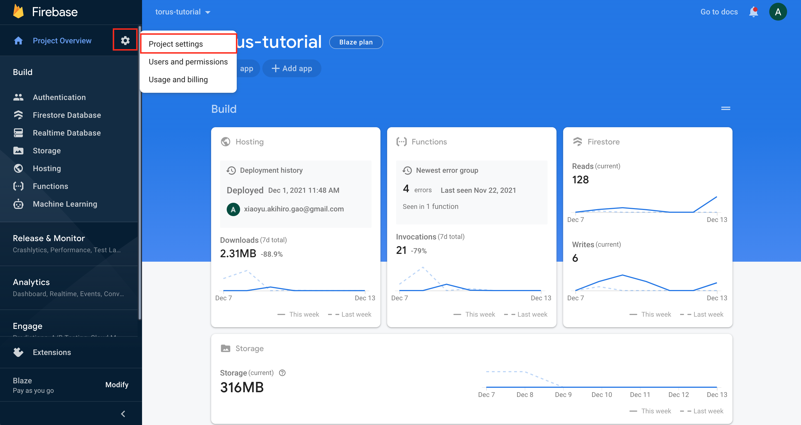
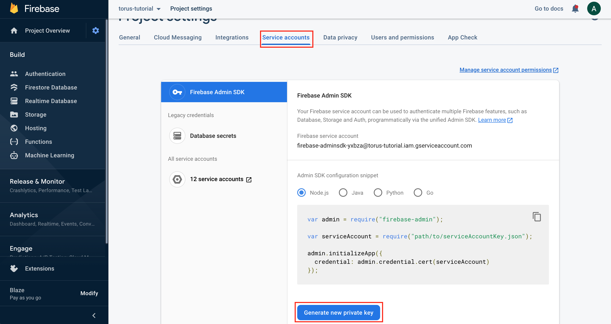

# Coral Monorepo

Monorepo managed with [Yarn Workspaces](https://classic.yarnpkg.com/en/docs/workspaces/).
Web application written in [TypeScript](https://www.typescriptlang.org/) and built with [React](https://reactjs.org/), [Emotion](https://emotion.sh/docs/introduction), and [Next.js](https://nextjs.org/). UI components developed in and documented using [Storybook](https://storybook.js.org/).
Authentication and database handled by [Firebase](https://firebase.google.com/) and application deployed to [Vercel](https://vercel.com).

## Setup

Please first make sure you have [Yarn Classic](https://classic.yarnpkg.com/lang/en/docs/install) installed.
To set up the project, run the following commands below:

```bash
git clone https://github.com/Coral-Music/coral-monorepo.git
cd coral-monorepo
yarn install

npm i -g firebase-tools
# please make sure you've been added to the firebase project before proceeding with this step
firebase login
```

Next, go to the Firebase Console and go to Project Settings as below:


Inside of Project Settings, navigate to the Service Accounts tab, and click the Generate new private key.


Take the JSON data from this file and add it to `.local.env` in the [app](/workspaces/app) workspace.

**NOTE**: Please **DO NOT** save this file anywhere inside the `coral-monorepo` directory.

Please also go the _General_ tab in the same view on the Firebase dashboard and copy the values under _SDK setup and configuration_ in the _Your apps_ section, convert it to `JSON` and add it to `.local.env` in the [app](/workspaces/app) workspace.

You can find more instructions & details regarding environment variable details in the [`app` Workspace README](/workspaces/app/README.md).

### Local Mobile Device Testing

To test mobile devices locally, please install [ngrok](https://ngrok.com/) from https://ngrok.com/download.

Then add a `ngrok.yaml` file with the configuration below:

```yaml
authtoken: <YOUR_NGROK_AUTH_TOKEN>
tunnels:
  web:
    addr: 3000
    proto: http
    hostname: coral.ngrok.io
version: 2
region: us
```

Please note that any values surrounded by `<` `>` and are placeholder values, and must be filled in with the actual value.

you can get your `authtoken` from https://dashboard.ngrok.com/get-started/your-authtoken.

## Available Scripts

In the project directory, you can run:

### `yarn <WORKSPACE_NAME>`

Which is shorthand for `yarn workspace <WORKSPACE_NAME>`.
Using this script, you can run arbitrary scripts for each respective workspace:

#### Example:

`yarn <WORKSPACE_NAME> start`

#### Available Workspaces

- [app](/workspaces/app)
- [contracts](/workspaces/contracts)

### `yarn start:tunnel`

Starts a tunnel from your local development environment to [coral.ngrok.io](https://coral.ngrok.io).

**NOTE**: Please run `yarn app start` before running this script.
